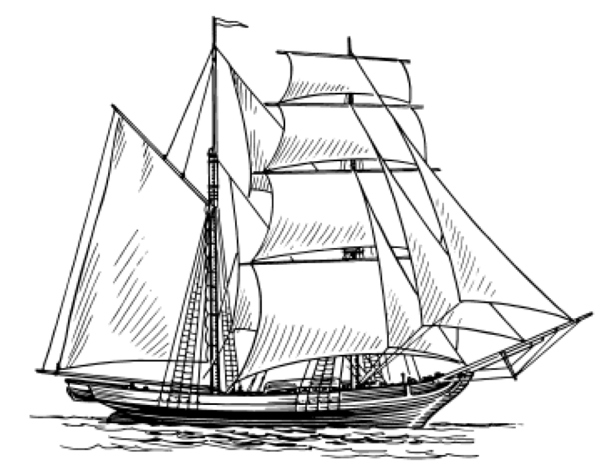

 

# Clipper Ship Data Analysis

This project was developed during a Hackathon event (DeisHacks 2023), with the goal of aiding the Clipper Ship Foundation's data collection and visualization problem. The Brandeis mentor for the Clipper Ship Foundation, Cameron, shared the data collection and analysis related issues that the people at the organization were facing and their enthusiasm for finding a solution. Therefore, we utilized our coding skills and belief in making a difference to make their vision a reality.

## Problem Statement
Clipper Ship's method of data collection was haphazard, which made the processes of aggregating, cleaning, and visualizing their data quite challenging and time-consuming. There was a clear need for a more streamlined and efficient data management solution.
## Solution
Our solution to this problem involved two steps. First, we created an Excel sheet designed to ask crucial questions related to the grants such as, "How many youth do you have in your program?", "How much grant money did you use?", "How many were placed into housing?", etc.

The second part of the solution involved creating an internal data analytics tool that allows the Clipper Ship Foundation to upload Excel sheets in a standardized format. This tool offers the foundation insight into important data regarding the usage of their grant money across different non-profits they support within their local community.
## Technology Stack
We built this application using PyScript, a python front and back-end software released on April, 2022. PyScript is a framework that allows users to create rich Python applications in the browser using HTML's interface, and harnessing the power of Pyodide, WASM, and modern web technologies.

This robust framework is well-suited for users at every experience level, offering an expressive, easy-to-learn programming language with endless applications. Importantly, PyScript allowed us to easily import data analytics libraries such as pandas and matplotlib, all while providing a user-friendly front-end.
## Future Directions
We believe this is just the start and there are many opportunities to improve and expand this application. This project has the potential to truly make an impact on the organization and the community it serves.
